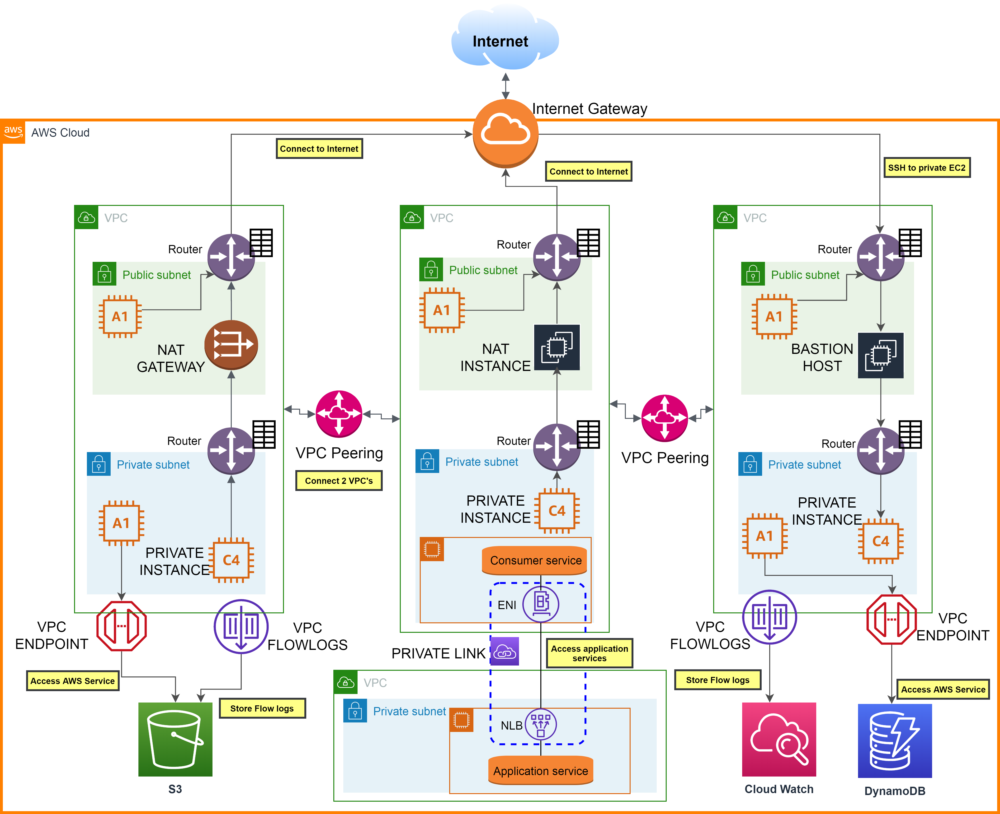
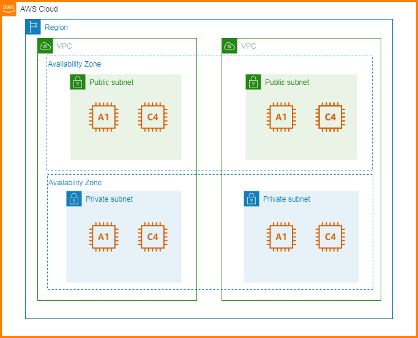

# Understanding Networking In AWS

- [Networking Within AWS Overview](#Networking-Within-AWS-Overview)
- [Networking Outside AWS Overview](#Networking-Outside-AWS-Overview)
- [Virtual Private Cloud](#Virtual-Private-Cloud)
- [Subnet](#subnet)
- [NACL](#NACL)
	 - [Default NACL](#default-nacl)
	 - [Custom NACL](#custom-nacl)
- [VPC Peering](#VPC-Peering)
- [VPC End point](#VPC-End-points)
- [Bastion Hosts](#Bastion-Hosts)
- [Site to Site VPN](#Site-to-Site-VPN)

# Networking Within AWS Overview

# Networking Outside AWS Overview

# Virtual Private Cloud

A *Virtual Private Cloud* or **VPC** is a logically isolated section of the AWS Cloud where you can launch instances

## What is allowed?

* Max of 5 VPC's are allowed to be created but you can place a request to AWS support for more
* Each VPC can have a max of 5 CIDR'S
* Each CIDR should have atleast (min) of 16 ip's (/28) or upto (max) of 65536 ip's (/16)
* Only private ranges are allowed in a VPC
	* 10.0.0.0 - 10.255.255.255 (10.0.0.0/8)          - Large corporations
	* 172.16.0.0 - 172.31.255.255 (172.16.0.0/12)     - AWS
	* 192.168.0.0 - 192.168.255.255 (192.168.0.0/16)  - Home or small networs
* VPC can span across multiple availibility zones in a region

## What is not allowed?

* VPC cannnot span across multiple regions
* No overlap of CIDR ranges is allowed between other VPC'S in your network

# Subnet 

Is a logical sub division of a larger network (VPC)

## Restrictions

* Subnets are tied to an Availibility zone
* AWS reserves 5 Ip address which cannot be used, the first 4 and last Ip in a created Subnet.
	They will be used for:

	* First one for Network address
	* Second one for VPC Counter
	* Third one for Mapping AWS provided DNS
	* Fourth for future use
	* Fifth for Network broadcast Address

So if you need a **particular no of instances**, calculate the CIDR by considering to exclue these five instances in the actual count.

## Types

### Public subnet 

Has instances with private IPs, attached to public IP's that are routed to the Internet via the Internet Gateway

#### Internet connection via

##### Internet Gateway

 An internet gateway provides access for Ip packets into and/or out of a local network to the internet.

###### How to connect

* Create an EC2 instance in public subnet of VPC if not exists
* Create an Internet Gateway
* Attach the Internet gateway to VPC 
* Edit the route table of the VPC to point tcp to the internet gateway

###### Restrictions

* One VPC can be connected to only one VPC, vice-versa

### Private subnet

Has instances with only private IP and are routed to the internet through NAT gateway Id

#### Internet connection via

##### 1. NAT Instances (Old)

Allow instances in private subnets to connect to the internet

###### Restrictions

* Must be launched in a public subnet
* Disable flag source/destination Check
* Must have elastic IP attaced to it

###### How to connect

* Create an EC2 instance in private subnet of VPC if not exists
* Create a NAT instance in a public subnet
* Modify security group of NAT instance to allow http/s from VPC 
* Disable flag source/destination Check
* Edit the route table of the private subnet to point http to the NAT instance

##### 2. NAT Gateway (New)

It is a NAT that is completeley mangaged by AWS which is aid by hour based on usage.
It will have high availibilty and no admin overhead as the NAT instance.

###### Restrictions

* Is created in a specific AZ
* Cannot be used by instances in the subnet that it is created
* Needs an Internet gateway 

###### How to connect

* Create an EC2 instance in private subnet of VPC if not exists
* Create a NAT Gateway in the public subnet
* Edit the route table of the private subnet to point http to the NAT Gateway

# NACL

Network access control lists provide security to VPC's and act like a firewall to a subnet

## Default NACL

Allows all inbound and outbound traffic by default 

## Custom NACL

Deny's any incoming or outgoing traffic by default and has to to be configured with rules for the same
One NACL per Subnet can be configred
Rules defined in NACL have a rule number and the lower the number higher the precedence

# VPC Peering

Helps in connecting 2 VPC's privately using AWS network

## Restictions

* CIDR's should not overlap
* They are not transitive which means you have to create a new VPC peering connection between 2 VPCs if you want them to connect
* Works inter region and cross account

## How to connect

* Create a new VPC peering connection
* Select the 2 VPC's to connect
* Edit the route table's on both the VPC's to connect the target addresses(CIDR) to peering connection

# VPC End points

Allows connection to AWS resources like DynamoDB, CloudWatch,S3 etc within AWS network instead of going through the internet gateway

## Interface end points

Provisions an ENI which must be attached to security group
Used for most AWS services
Enable DNS hostname and Enable DNS support should be set to true

## Gateway end points

Provisions a target which must be used in route table 
Used for S3, Dynamo

# VPC Flow logs

Are attached to VPC which helps to monitor and troubleshot connectivity issues in VPC
It captures information about IP traffic going to interfaces
Flow logs can be stored in S3 or Cloudwatch logs

**Athena** can be used to query and analyze flow logs

# Bastion Hosts

A Bastion host is an instance that sits in a public subnet and enables to SSH into private instances.

## How to setup

* Create an instance in the public subnet
* Configure the security group of the bastion host instance to allow only the IP's you require to perform SSH on the private instances
* Allow the security group of the bastion host for SSH on the private instance **Not sure check this**

# Site to Site VPN

If we have some on premise infrastucture and infrastucture on AWS cloud we might want to connect them to make them behave like one network and we use **Site to Site VPN** to achieve this.

## How to setup

* We need a **Customer Gateway**(software or physical) on the on premise side and to link:
     * Use a static internet routable Ip address of the Customer Gateway on the on Premise side
     * Or if Customer Gateway is behind a NAT in the customer site then use the public Ip of the NAT
* We need a **Virtual Private Gateway** at the AWS VPC side which can be created in AWS
* Create a Site to Site VPN to connect these Gateways

# Direct Connect

When we need a physical connection between the on premise and the AWS cloud we go for a Direct connect gateway.

By doing this we avoid the public intenet and have a direct private connection for a better throughput

However the the data that is send through this private link is not encrypted, fow which you might have to configure it through a VPN

## How to setup

* Request for a Direct connection
* A connection between the on premise and AWS Direct connection location is made which could take a month 
* Create a Virtual private gateway for your VPC to communcate to the AWS direct location

## Direct connect gateway

In case we want to use the Direct connect link to also connect to VPC's in other regions then we need a **Direct Connect Gateway**

So we can leverage the same Direct connect link and communicate to other VPC's in different regions

Note that the Direct connect Gateway will not allow you to connect a VPC to VPC in AWS as for this u still need to have a VPC peering connection.

## Egress only Internet Gateway

* **Ingress means Incoming**
* **Egress means Outgoing**

The Egress only Interget Gateway is designed for instances with IPV6 that allows internet access to these instances but remain private to the outside world.

That means incoming is blocked.

**Reason** Unlike IpV4 all IPV6 addresses are public addresses so it is necessary to have the incoming traffic blocked incase we want to have it private.

## How to setup

* Create a Egress only Internet Gateway and attach to the VPC 
* Edit the route table by configuring IpV6 addresses target to the Egress only Internet Gateway

# AWS Private Link - VPC endpoint services

We might have a situation where we have a VPC that is hosting a service and it has to be consumed by other services in other VPC's in the same or other accounts.

We can achieve this by:

* Making it accesible through a public URL
  * The disadvantage is that the call will go through the public internet
* Or create a VPC peering connection to the consumer VPC 
  * The disadvantage is that the we have to make make this connection to all the VPC's that want to consume this service and in addition to that all the services other than the intended service also gets exposed.

To overcome this **AWS Private link" or **VPC endpoint Service** was created which allows to expose services to other 1000's of VPC's within the AWS network without having to manage VPC peering, route tables, NAT's etc.

## How to configure

* The service is exposed through a network load balancer on the service VPC
* The service is consumed through an ENI(Elastic network interface) by the consuming service created in the other VPC
* They are connected by a VPC Private Link 

# AWS Classic link (Deprecated)

# VPN Cloud Hub

In case there are multiple customer on premise sites and AWS cloud network with multiple VPN connections then **VPN Cloud Hub** helps to provide a secure communication between them.

It is a virtual setup and hence it happens through the public network.

# Transit Gateway

The Transit Gateway helps to simplify the complexity caused my many networking connections in the AWS setup like the VPC peering, VPN, Direct connect Gateway etc

* It provides a **hub and spoke(Star)** type of connection with the various elements
* It can work cross region
* It can work cross account using Resource access manager(RAM)
* Supports **IP multicast**

## How to configure

* Configure the route table of the Transit gateway to configure which element can communicate to the other element

# Networking Costs

